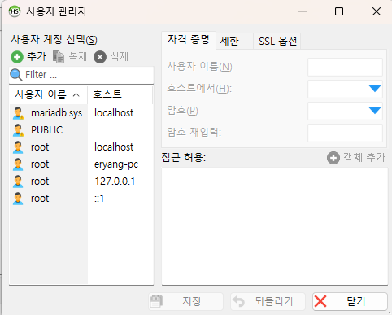
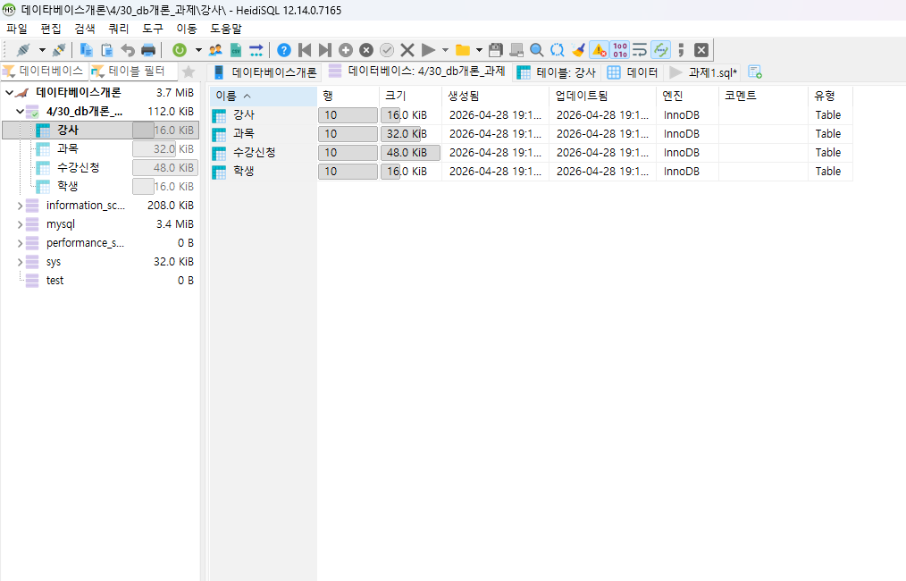
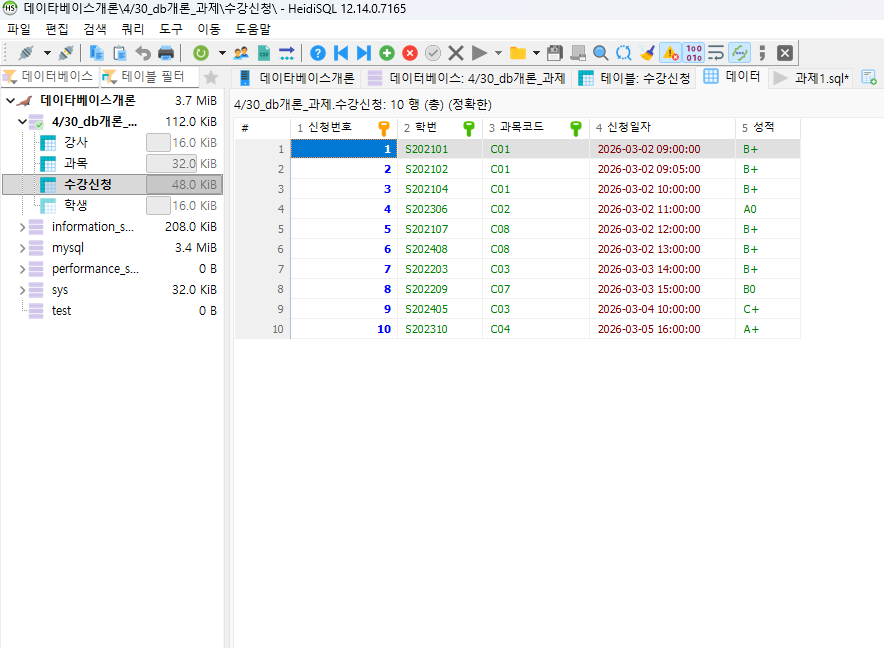
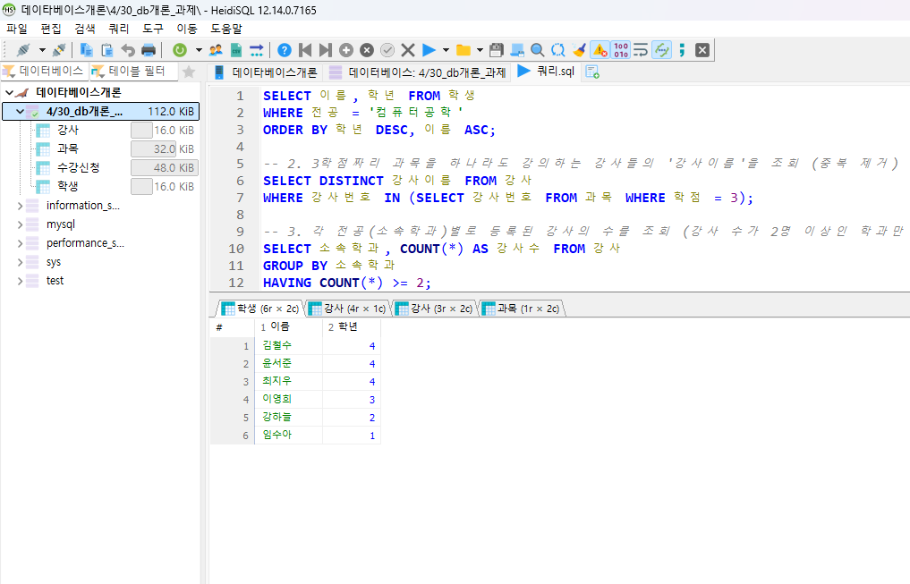

# 데이터베이스 언어 SQL 보고서 
> [GitHub 바로가기](https://github.com/jeongiryang/DatabaseLanguage_SQL_Assignment.git)

- **이름** : 정이량
- **학번** : 2022 2017
- **과목명** : 데이타베이스개론 

## 1. 인증 스크린샷

### 1.1 본인 컴퓨터 설치 및 IP 인증

> **설명:** HeidiSQL(MariaDB)에서 로컬 환경의 본인 컴퓨터 서버 접속 인증 ip주소 화면.


## 1.2 과제 단계별 실행 결과

| **단계** | **실행 결과 및 인증 화면** |
| :---: | :---: |
| **1. DDL (테이블 생성)** |  <br> *학생, 강사, 과목, 수강신청 테이블 구조 정의 완료* |
| **2. DML (데이터 입력)** |  <br> *각 테이블별 10개 이상의 샘플 데이터 삽입 완료* |
| **3. Query (최종 미션)** |  <br> *요구사항 6문항 질의 해결 및 결과 확인* |

---

## 2. SQL 쿼리 첨부

### 2.1 테이블 생성 (DDL)
```sql
-- 1. 학생 테이블 생성
CREATE TABLE 학생 (
    학번 VARCHAR(20) PRIMARY KEY,
    이름 VARCHAR(50) NOT NULL,
    전공 VARCHAR(50),
    학년 INT CHECK (학년 >= 1 AND 학년 <= 4)
);

-- 2. 강사 테이블 생성
CREATE TABLE 강사 (
    강사번호 VARCHAR(20) PRIMARY KEY,
    강사이름 VARCHAR(50) NOT NULL,
    소속학과 VARCHAR(50),
    이메일 VARCHAR(100)
);

-- 3. 과목 테이블 생성
CREATE TABLE 과목 (
    과목코드 VARCHAR(20) PRIMARY KEY,
    과목명 VARCHAR(100) NOT NULL,
    학점 INT DEFAULT 3,
    강사번호 VARCHAR(20),
    FOREIGN KEY (강사번호) REFERENCES 강사(강사번호)
);

-- 4. 수강신청 테이블 생성 (성적 속성 포함)
CREATE TABLE 수강신청 (
    신청번호 INT AUTO_INCREMENT PRIMARY KEY,
    학번 VARCHAR(20),
    과목코드 VARCHAR(20),
    신청일자 DATETIME,
    성적 VARCHAR(5),
    FOREIGN KEY (학번) REFERENCES 학생(학번),
    FOREIGN KEY (과목코드) REFERENCES 과목(과목코드)
);
```

---

### 2.2 데이터 입력 (DML)

```sql
-- 학생 데이터 입력 (10명)
INSERT INTO 학생 (학번, 이름, 전공, 학년) VALUES 
('S202101', '김철수', '컴퓨터공학', 4), ('S202102', '이영희', '컴퓨터공학', 3), 
('S202203', '박민수', '정보통신', 2), ('S202104', '최지우', '컴퓨터공학', 4), 
('S202405', '정다은', '전자공학', 1), ('S202306', '강하늘', '컴퓨터공학', 2), 
('S202107', '윤서준', '컴퓨터공학', 4), ('S202408', '임수아', '컴퓨터공학', 1), 
('S202209', '조현우', '정보통신', 3), ('S202310', '한예슬', '디자인', 2);

-- 강사 데이터 입력 (10명)
INSERT INTO 강사 (강사번호, 강사이름, 소속학과, 이메일) VALUES 
('T101', '홍길동', '컴퓨터공학', 'hong@univ.ac.kr'), ('T102', '김교수', '컴퓨터공학', 'kim@univ.ac.kr'), 
('T103', '이강사', '정보통신', 'lee@univ.ac.kr'), ('T104', '최박사', '전자공학', 'choi@univ.ac.kr'), 
('T105', '박전문', '디자인', 'park@univ.ac.kr'), ('T106', '정교수', '컴퓨터공학', 'jung@univ.ac.kr'), 
('T107', '임강사', '정보통신', 'lim@univ.ac.kr'), ('T108', '송박사', '컴퓨터공학', 'song@univ.ac.kr'), 
('T109', '배교수', '전자공학', 'bae@univ.ac.kr'), ('T110', '유강사', '경영학', 'yoo@univ.ac.kr');

-- 과목 데이터 입력 (10개)
INSERT INTO 과목 (과목코드, 과목명, 학점, 강사번호) VALUES 
('C01', '데이터베이스', 3, 'T101'), ('C02', '알고리즘', 3, 'T102'), 
('C03', '회로이론', 3, 'T103'), ('C04', '디자인론', 2, 'T105'), 
('C05', '자료구조', 3, 'T102'), ('C06', '운영체제', 3, 'T106'), 
('C07', '임베디드', 3, 'T107'), ('C08', '웹프로그래밍', 3, 'T101'), 
('C09', '인공지능', 3, 'T101'), ('C10', '캡스톤디자인', 3, 'T108');

-- 수강신청 데이터 입력 (10개)
INSERT INTO 수강신청 (학번, 과목코드, 신청일자, 성적) VALUES 
('S202101', 'C01', '2026-03-02 09:00:00', NULL), ('S202102', 'C01', '2026-03-02 09:05:00', NULL), 
('S202104', 'C01', '2026-03-02 10:00:00', NULL), ('S202306', 'C02', '2026-03-02 11:00:00', 'A0'), 
('S202107', 'C08', '2026-03-02 12:00:00', NULL), ('S202408', 'C08', '2026-03-02 13:00:00', NULL), 
('S202203', 'C03', '2026-03-03 14:00:00', 'B+'), ('S202209', 'C07', '2026-03-03 15:00:00', 'B0'), 
('S202405', 'C03', '2026-03-04 10:00:00', 'C+'), ('S202310', 'C04', '2026-03-05 16:00:00', 'A+');
```

---

### 2.3 과제 요구 조회 쿼리

```sql
-- 1. '컴퓨터공학' 전공인 학생들의 이름과 학년을 조회 (학년 내림차순, 이름 오름차순 정렬)
SELECT 이름, 학년 FROM 학생 
WHERE 전공 = '컴퓨터공학' 
ORDER BY 학년 DESC, 이름 ASC;

-- 2. 3학점짜리 과목을 하나라도 강의하는 강사들의 '강사이름'을 조회 (중복 제거)
SELECT DISTINCT 강사이름 FROM 강사 
WHERE 강사번호 IN (SELECT 강사번호 FROM 과목 WHERE 학점 = 3);

-- 3. 각 전공(소속학과)별로 등록된 강사의 수를 조회 (강사 수가 2명 이상인 학과만 출력)
SELECT 소속학과, COUNT(*) AS 강사수 FROM 강사 
GROUP BY 소속학과 
HAVING COUNT(*) >= 2;

-- 4. '홍길동' 강사가 담당하는 과목 중 성적이 입력되지 않은(NULL) 건들의 성적을 'B+'로 수정 (서브쿼리 활용)
UPDATE 수강신청 SET 성적 = 'B+' 
WHERE 성적 IS NULL 
  AND 과목코드 IN (
    SELECT 과목코드 FROM 과목 
    WHERE 강사번호 = (SELECT 강사번호 FROM 강사 WHERE 강사이름 = '홍길동')
  );

-- 5. 수강신청 인원이 3명 이상인 과목의 '과목명'과 해당 과목을 담당하는 '강사이름'을 조회 (서브쿼리 활용)
SELECT 과목명, 
       (SELECT 강사이름 FROM 강사 WHERE 강사.강사번호 = 과목.강사번호) AS 강사이름
FROM 과목 
WHERE 과목코드 IN (
    SELECT 과목코드 FROM 수강신청 
    GROUP BY 과목코드 
    HAVING COUNT(*) >= 3
);

-- 6. 수강생이 한 명도 없는 과목들을 과목 테이블에서 삭제 (서브쿼리 활용)
DELETE FROM 과목 
WHERE 과목코드 NOT IN (SELECT DISTINCT 과목코드 FROM 수강신청);


```