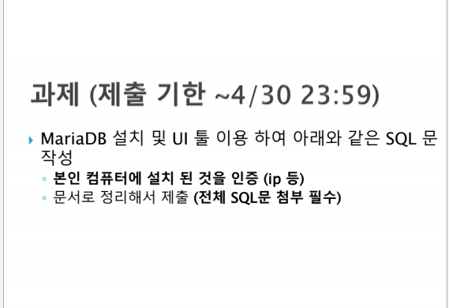
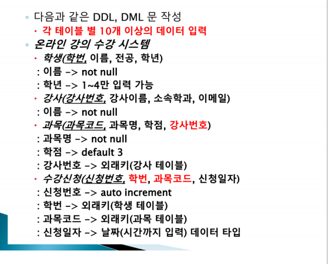

# 데이터베이스개론 과제(~04/30): MariaDB 환경구축 및 UI툴을 사용하여 요구사항에 맞는 SQL 쿼리문 작성

- '데이터베이스 개론' 과목의 SQL 과제 수행 및 기록을 위해 작성.

- MariaDB를 활용하여 간단한 DML, DDL을 사용하는 쿼리문 실습

---

## 환경 
- **Database Server:** MariaDB
- **Client (UI Tool):** HeidiSQL
- **Language:** SQL

---

## 과제 정보 
| 요구사항  |
| :---: |
|  |
|  |
|  |


---

## 구조 
다음의 폴더와 파일이 SQL 쿼리문과 보고서가 커밋될 예정.

```text
Introduction_to_Database_Assignment/ # root/
├── SQL_query/                    # SQL 쿼리문 보관 폴더
│   ├── 01_DDL.sql                # 테이블 생성 쿼리 (학생, 강사, 과목, 수강신청)
│   ├── 02_DML.sql                # 테이블에 데이터 삽입 쿼리 (각 테이블당 10건 이상)
│   └── 03_Queries.sql            # 과제 요구사항 6가지 조건 검색/수정/삭제 쿼리
├── screenshots/                  # 보고서 및 README 캡처 이미지 (요구사항, 실행 결과 등)
├── REPORT.md                     # 최종 실행 결과 화면 캡처 및 보고서
└── README.md                     # 프로젝트 통합 가이드 및 개요
```